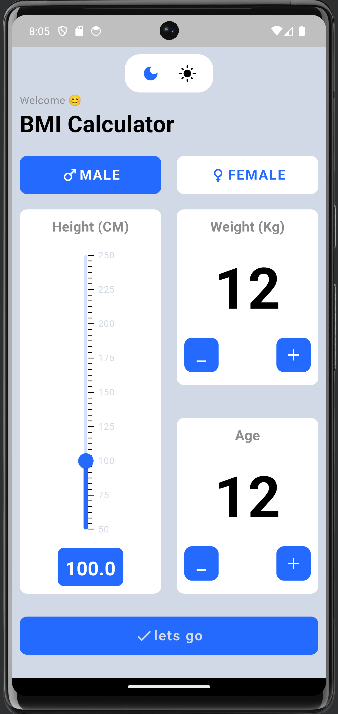

This is a BMI App

This app use height and weight to compute user's BMI.

After calculating BMI, the app categorizes the result into standard ranges 
like underweight, normal weight, overweight, and obese, according to established BMI categories.

This app also provide advance feature like dark mode, light mode, age, gender.

The color of result page changes according to the BMI result like A person has normal BMI then the 
Result page will be in green color.

Let's take a look to the App.

 

